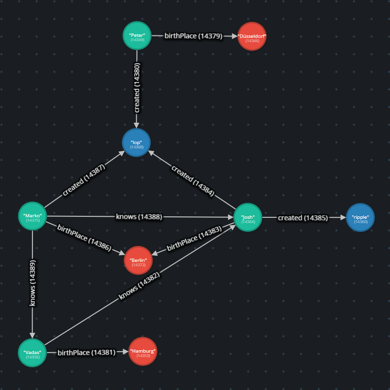

# Java-Graph-Persistence: Test data

This package provides an example set of test data. It is based on the same people relationship, used
in [Apache Tinkerpop Documentation](https://tinkerpop.apache.org/docs/current/reference/#graph-computing).

    

You can view all details of the example at [Gremlify](https://gremlify.com/urmin5evt5p/3).